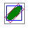

# splat

The objective of that repository is to implement multiple versions of 3D Gaussian Splatting renderer for learning purposes.
I started from antimatter webgl implementation, I migrated.

Implementations `SplatsRendererX.py`:
- `Gl` : the closest from the antimatter webgl viewer (using texture)
- `GlGeo` : Opengl (using geometry shader) 📌
- `GlGeoConic` : Opengl conic (vs eigenvectors)
- `GlNoVertexSh` : Hybrid: Numpy for the projection - OpenGL for the rasterization
- `Loop` : CPU looping
- `Np` : CPU using Numpy (~1min for the garden)
- `Vk` : Vulkan (using geometry shader)

Here, we want to make sur that the axis and garden ply are always render the same accross the implementations.

To run the js webgl viewer:
```shell
cd web
npm install
npm run dev
```

To run the python viewers:
```shell
# conda remove -n splat-render --all
cd python
conda env create -f environment.yml
conda activate splat-render
python main.py
```

You might need to
- call with prefix `__NV_PRIME_RENDER_OFFLOAD=1 __GLX_VENDOR_LIBRARY_NAME=nvidia python main.py` or
- add as environment variables `__NV_PRIME_RENDER_OFFLOAD=1;__GLX_VENDOR_LIBRARY_NAME=nvidia`

Some renderer uses Vulkan (Ubuntu):
- Install:  
`sudo apt install vulkan-tools libvulkan-dev vulkan-validationlayers-devvulkan-validationlayers glslang-tools`
- To compile shader and run:  
`(cd vk_shaders && bash ./compile.sh) && python main.py`


# Technicals explanations

## Benchmarking pre-multiplying and blending order
How can we explain that pre-multiplying the rgb * a in the fragment boost the fps? Test done on my iGPU, webgl, conic.
  - `gl.blendFunc(gl.ONE_MINUS_DST_ALPHA, gl.ONE)` - front to back - 45fps - `fragColor = vec4(vColor.rgb * a, a)` - `dst.rgba = src.rgba * (1-dst.a) + dst.rgba * 1`
  - `gl.blendFunc(gl.ONE, gl.ONE_MINUS_SRC_ALPHA)` - back to front - 38fps - `fragColor = vec4(vColor.rgb * a, a)` - `dst.rgba = src.rgba * 1 + dst.rgba * (1-src.a)`
  - `gl.blendFunc(gl.SRC_ALPHA, gl.ONE_MINUS_SRC_ALPHA)` - back to front - 34fps - `fragColor = vec4(vColor.rgb, a)` - `dst.rgba = src.rgba * src.a + dst.rgba * (1-src.a)`
  - as a reference the antimatter version (not conic) - 53fps

## Antimatter vs Conic version - rasterization
Conic version is the one used by INRIA and antimatter uses a more optimized version where "fragment is rotated".
In the image, in green the splat (without the gaussian opacity) and:
- in blue the fragment of the conic version (aligned with axis)  
- in pink the fragment of the antimatter version (rotated - OBB)  
- in gray the fragment of the antimatter un-rotated version, I implemented in webgl and python 

